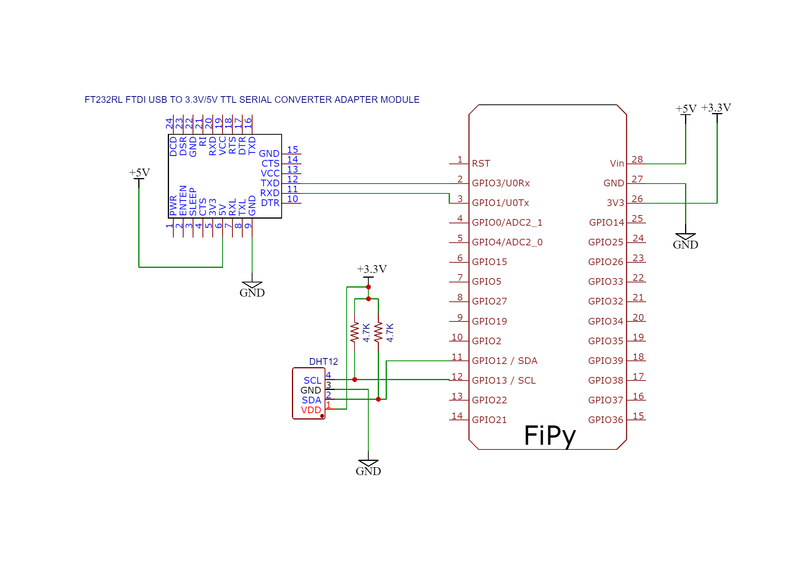
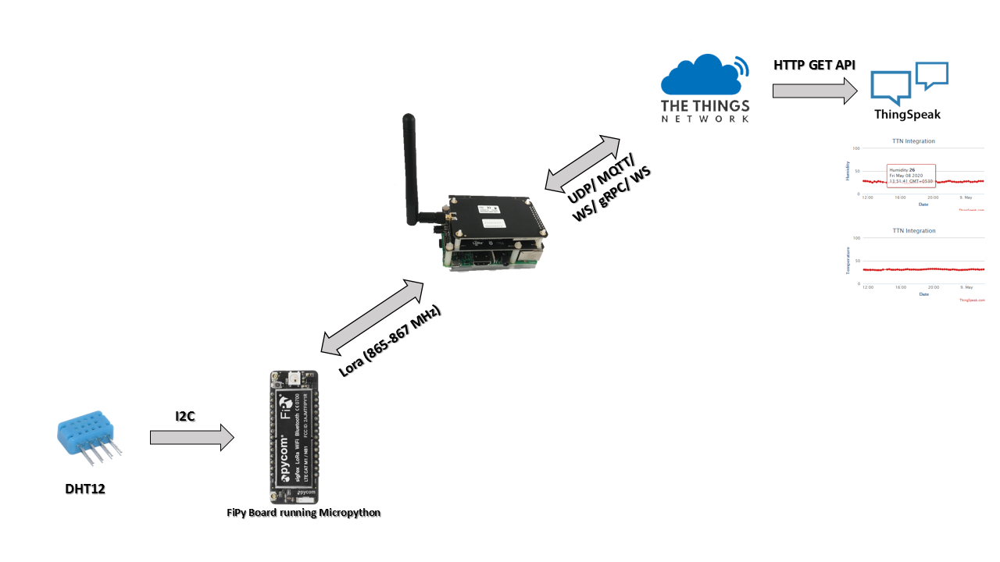

# FiPy LoRaWAN TTN DHT12 Project
DHT12 and FiPy Connection Daigram, 



The data flow from the DHT12 senor to the ThingSPeak charts looks like, 



The JS code used in TTN decoder function is, 

```js
function Decoder(bytes, port) {
    var decoded = {};
    if (bytes[0] + bytes[1] + bytes[2] + bytes[3] == bytes[4]) {
        var humidity = bytes[0] + bytes[1] / 10;
        var scaleValue = bytes[3] & 0xEF;
        var signValue = bytes[3] & 0x80;
        var temperature = bytes[2] + scaleValue / 10

        if (signValue)
            emperature = -temperature

        decoded.field1 = temperature;
        decoded.field2 = humidity;
    }
    return decoded;
}
```

## Relevant Links:

* Fipy: https://bit.ly/2VWfPvP
* The Things Network: https://bit.ly/3dtxLnB

* Thingspeak: https://bit.ly/2zm9aCu
* DHT12 Datasheet: https://bit.ly/3clBPWT
* About LoRa: https://bit.ly/2A9wkMA
* About LoraWAN: https://bit.ly/2WGnHkr

* Updating Firmware for FiPy: https://bit.ly/35KyfD4
* FiPy VS Code Extension Setup: https://bit.ly/3bnwM6S
* Setting up a cheap LoRaWAN Gateway: https://bit.ly/2WsiFHS
* ESP32 LoRaWAN Node: https://bit.ly/2zjv2y4
